# Predictive tag

Available (free) in the [Microsoft Store](https://www.microsoft.com/store/apps/9N021Q9N8STK).

## Summary

An open source app that uses machine learning to suggest descriptive metadata tags for a resource.

## Features

- Uses a learning model to suggest tags that might be relevant to a current tag.
- Indicates whether suggestions are available as you type.
- Built-in spell checking along with suggestions for misspelled words. The spellcheck language is configurable.
- Suggestions are cached to avoid repeated searches.
- Reminders are issued for tags on a configurable notify-list.
- Generates a comma-separated tag string from your chosen list of tags.
- Analyzes a historical dataset of previously assigned tags to generate suggestions.
- Merges team member learning models to accelerate learning.
- Configurable tag presets.
- Configurable maximum number of tags.

## Upcoming features

- Narrowing the suggestion search-space as users type each letter of a tag.
- JSON data format and MongoDB backend instead of text files.

## Getting started

1. To get started, enter an initial tag. The highlighted **Suggest** button turns green when suggestions are available for that tag. Click the **Suggest** button or press **Enter** to see the suggestions. 

    <!--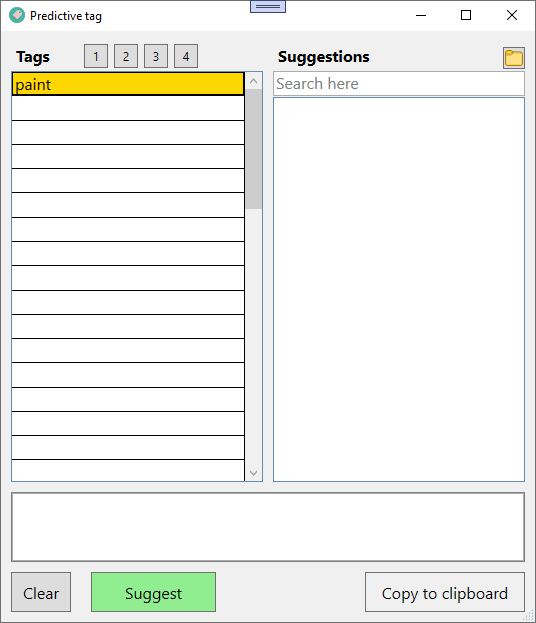-->

    

2. A list of suggested tags will appear in the **Suggestions** box. Color-coded entries are generated by the learning model. You can search and filter suggestion results using the search box.

    <!--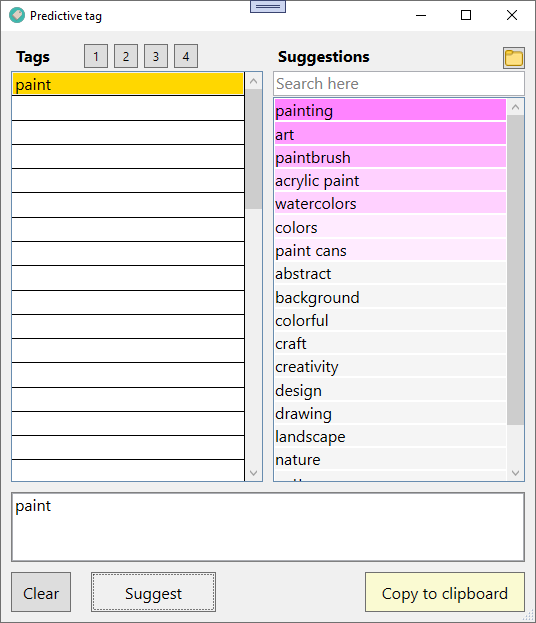-->

    

3. Double-click any suggestion in the **Suggestions** area to add it to your tags. You can also add suggestion text from the search box tags by double-clicking the search box or pressing **Enter**. The learning model associates your added suggestion with the orange highlighted tag. After you've selected a suggestion, you can double-click it again to increase it's precendence in the color-code list.

    <!--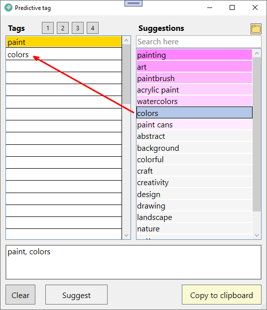-->

    

4. Add any number of suggestions. To move to the next row in the Tags area and enter edit mode, press the **Tab** key twice.

    <!--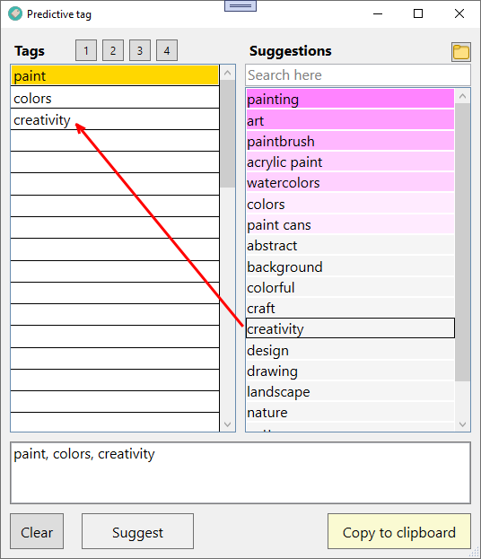-->

    

5. If needed, you can remove tag-suggestion associations by right-clicking a color-coded suggestion and choosing the **Unrelate...** option.

    <!--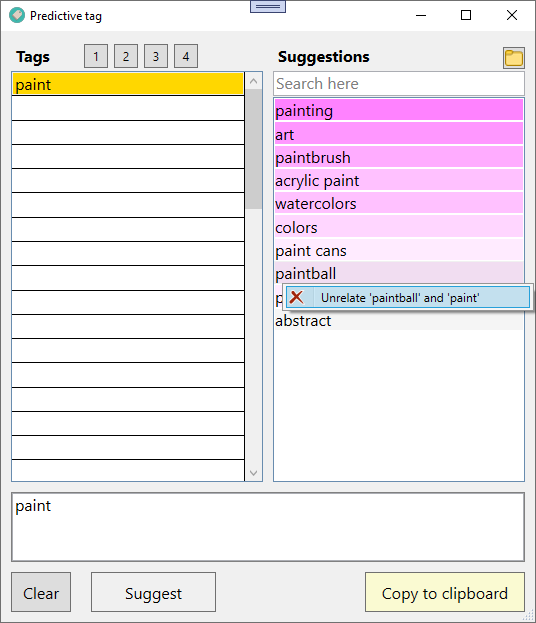-->

    

6. Enter tags manually if they don't appear in the list of suggestions. The app will learn their relevance and suggest them in the future when they are applicable.

    <!--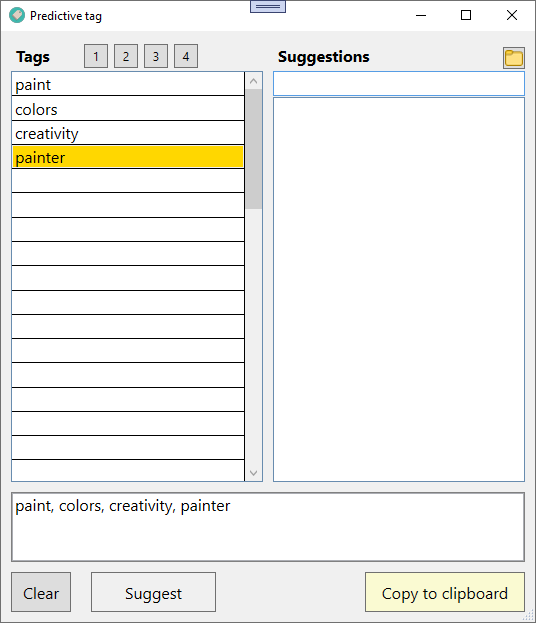-->

    

7. The app will add a red squiggle under misspelled tags. Right-click a misspelled tag to see one or more suggestions.

    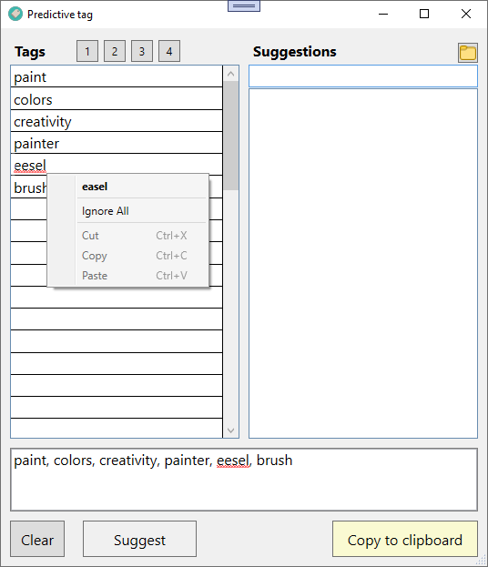

8. Optionally, select one of the numbered tag-preset buttons to add a specific set of tags. For more information, see [Config](#config).

    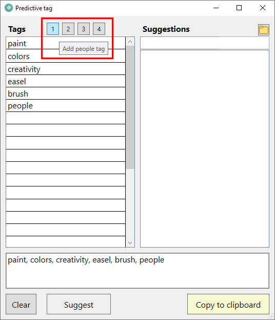

9. Choose **Copy to clipboard** to export your tags as a comma-separated string.

## App files

The app creates and uses these data files:

- [historical-data.txt](#historical-data)
- [learn-data.xml](#learn-data)
- [notify-data.txt](#notify-data)
- [config.xml](#config)

Click the folder icon in the top-right corner of the app UI to open the app folder.

### Historical data

The [historical-data.txt](../code/predictive-tag-proj/Resources/historical-data.txt) file stores all previously assigned tags. Each file line contains a set of comma-separated tags (a tagset) for a single resource, such as a book. Future tag suggestions are drawn from the historical tags. Here's some sample tagsets for images:

| Image | Tagsets | Attribution |
|-|-|-|
|  | owl, bird, animal, fauna, species, wildlife | [source](https://pixabay.com/photos/eurasian-pygmy-owl-owl-bird-6673562/) |
|  | forest, fog, trees, nature, wilderness, woods | [source](https://pixabay.com/illustrations/forest-fog-dark-trees-nature-6578551/) |
|  | snake, reptile, animal, fauna, species, wildlife | [source](https://pixabay.com/photos/snake-reptile-animal-scale-6662549/) |
|  | road, highway, trees, forest, asphalt, autumn, fall | [source](https://pixabay.com/photos/road-highway-trees-asphalt-forest-6724201/) |
|  | boats, lake, travel, vacation, outdoors, dusk, sunset | [source](https://pixabay.com/photos/boats-lake-travel-outdoors-dusk-6700576/) |
|  | beach, nature, sunset, sea, travel, vacation, dusk, outdoors | [source](https://pixabay.com/photos/nature-beach-sunset-travel-dusk-6723133/) |
|  | market, woman, child, hat, shawl | [source](https://pixabay.com/photos/peru-market-woman-child-hat-shawl-2363502/) |
|  | girl, child, childhood, grass, flowers, meadow | [source](https://pixabay.com/photos/girl-child-childhood-grass-flowers-6738285/) |
|  | elephant, animal, fauna, species, wildlife | [source](https://pixabay.com/photos/animal-elephant-fauna-species-6714423/) |
|  | sunset, sun, sea, vacation, landscape, clouds, nature | [source](https://pixabay.com/photos/sunset-sun-vacation-landscape-3563482/) |
|  | oil drop, water, oil, abstract, artistic, oily | [source](https://pixabay.com/photos/oil-drop-water-oil-abstract-oily-5807010/) |
|  | sunset, fields, trees, farmland, grassland, horizon | [source](https://pixabay.com/photos/sunset-fields-trees-farmlands-6212218/) |
|  | paint, painting, art, abstract | [source](https://pixabay.com/photos/abstract-painting-feathers-6047465/) |
|  | paint, painting, art, abstract, acrylic paint | [source](https://pixabay.com/photos/painting-abstract-background-3135875/) |
|  | paint, painting, art, watercolors, paintbrush, colors | [source](https://pixabay.com/photos/art-watercolors-arts-and-crafts-1851483/) |

### Learn data

The [learn-data.xml](../code/predictive-tag-proj/Resources/learn-data.xml) file stores every suggestion that a user has selected, along with the associated tag and the number of times the suggestion was selected for the tag.

### Notify data

The [notify-data.txt](../code/predictive-tag-proj/Resources/notify-data.txt) file contains the tags that if entered by the user will generate a notification. Edit the notify-data file as needed.

### Config

The [config.xml](../code/predictive-tag-proj/Resources/config.xml) includes these configuration options:

- Set the spellcheck locale (e.g. en-US, en-GB, fr-FR):

  ```
  <language>
    <spellchecker>en-GB</spellchecker>
  </language>
  ```

  Your operating system must have the corresponding language pack _with_ spellchecking installed. Language packs that aren't installed by an administrator won't include spellcheck support and your selected locale won't work. In the following Windows 11 screenshot, both English language packs have spellcheck support, but the French language pack doesn't.

  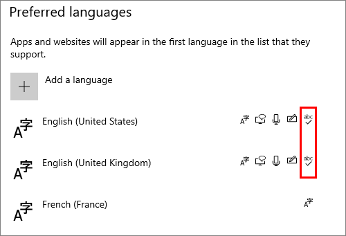

- Add up to five tag preset buttons:

  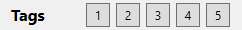

  The following XML adds preset buttons 1 and 2 only. When you click preset button 1, the tag `cat` will appear in the tag list. Similarly, when you click preset button 2, the tag `dog` will appear in the tag list. Use the *text* attribute to specify the popup tip for when your mouse hovers over a preset button.
  
  ```
  <presets>
    <preset text="Add a cat tag">
      <tag>cat</tag>
    </preset>
    <preset text="Add a dog tag">
      <tag>dog</tag>
    </preset>
  </presets>
  ```

- Set the maximum number (1-250) of tags allowable for a single resource:
  
  ```
  <tags>
    <max>75</max>
  </tags>
  ```

Edit the existing `config.xml` in the app folder, or drag and drop a new configuration file onto the **Suggestions** list pane to replace the existing configuration file.

## Accelerated learning

As you use the app, the `historical-data.txt` and `learn-data.xml` files become more comprehensive. To accelerate the app's learning process, team members can share and merge data files, including `notify-data.txt`. To do so, simply drag and drop any data file onto the **Suggestions** list pane. The app detects the data file type and merges it with the existing data file of the same type.

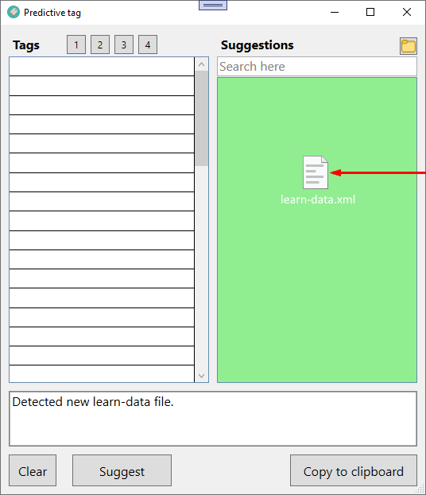

## Error reporting

The app reports any internal errors by creating and adding a timestamped entry to an `error.txt` file in the app folder. Click the folder icon in the top-right corner of the app UI to open the app folder. The `error.txt` file isn't created unless an error occurs. The file contains debugging information, such as the source code line number where the error occured.

## How tag suggestion works

1. The app filters all `historical-data.txt` tagsets to remove any tagset line that doesn't contain the user-entered tag (orange highlighted in the app UI).

1. The app combines all tags in the filtered tagsets into a 1D list and removes duplicates.

1. The app sorts the list of tags&mdash;by descending order of tag frequency within the filtered tagsets.

1. The app then applies its learning model to the sorted list of historical tags:

    1. Whenever a user designates a suggestion as relevant to a tag by selecting the suggestion, the app remembers that decision and promotes that suggestion's ranking relative to other suggestions that relate to that tag.
    1. All ranked suggestions that relate to the user-entered tag are color-coded and promoted in priority order to the top of the sorted list of historical tags.

1. When a user clicks **Copy to clipboard** on completion of tag selection for resource, the app adds the exported tagset to `historical-data.txt`.

In this way, both the the historical data and learn-data files respectively become more extensive and refined, as a result of an app user's choices.

## Manually compile a single file executable

Although it's easier to install the app from the Microsoft Store, you can compile and install the app using Visual Studio.

### Prerequisites

- [.NET 5+](https://dotnet.microsoft.com/download)
- [Visual Studio 2019+](https://visualstudio.microsoft.com/vs/)

### Create an executable

1. Open the project in Visual Studio.

1. From the menu bar, choose **Build** > **Publish...**

1. Choose to publish to a folder, then select **Finish**.

1. Choose **Show all settings**.

1. Choose **Framework-dependent** and **Produce single file** in the profile settings, and note the **Target location** of the compiled executable.

1. Choose **Publish**.
