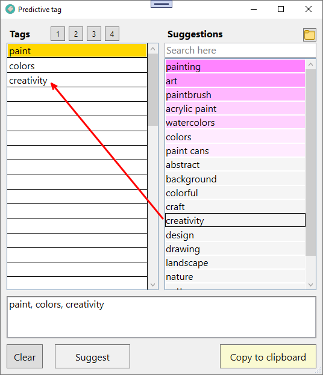

# Predictive tag

Available (free) in the [Microsoft Store](https://www.microsoft.com/store/apps/9N021Q9N8STK).

## Summary

An open-source app that uses a learning model to suggest descriptive metadata tags for a resource.

## Features

- Uses a learning model to suggest tags that might be relevant to a current tag.
- Indicates whether suggestions are available as you type.
- Uses built-in spell checking that's configurable for your local language.
- Suggestions are cached to avoid repeated searches.
- Reminders are issued for tags on a configurable notify-list.
- Generates a comma-separated tag string from your chosen list of tags.
- Analyzes a historical dataset of previously assigned tags to generate suggestions.
- Merges team member learning models to accelerate learning.
- Exports a comma-separated synonym string.


## Features under consideration

- Narrowing the suggestion search-space as users type each letter of a tag.
- JSON data format and MongoDB backend instead of text files.

## Getting started

1. To get started, enter an initial tag. The highlighted **Suggest** button turns green when suggestions are available for that tag. Click the **Suggest** button or press **Enter** to see the suggestions. 

    

2. A list of suggested tags will appear in the **Suggestions** box. Color-coded entries are generated by the learning model. You can search and filter suggestion results using the search box.

    

3. Double-click any suggestion in the **Suggestions** area to add it to your tags and promote its relevance. The learning model associates your added suggestion with the orange highlighted tag. After you've selected a suggestion, you can double-click it again to further promote it in the color-coded list.

    

    You can remove tag-suggestion associations by right-clicking a color-coded suggestion and choosing the **Unrelate...** option.

    

4. To move your cursor to the next tag row, press the **Tab** key twice.

    

5. You can also enter tags manually in the tags list. The app will learn their relevance and suggest them in the future when they are applicable.

    

    The app will add a red squiggle under misspelled tags. Right-click a misspelled tag to see one or more suggested corrections.

    

6. Optionally, select one of the numbered tag-preset buttons to add a specific set of tags. For more information, see [Config](#config).

    

7. Choose **Copy to clipboard** to export your tags as a comma-separated string.

## App files

The app creates and uses these data files:

- [historical-data.txt](#historical-data)
- [learn-data.xml](#learn-data)
- [notify-data.txt](#notify-data)
- [config.xml](#config)

Click the folder icon in the top-right corner of the app UI to open the app folder.

### Historical data

The [historical-data.txt](../code/predictive-proj/Resources/historical-data.txt) file stores all previously assigned tags. Each file line contains a set of comma-separated tags (a tagset) for a single resource, such as a book or image. Future tag suggestions are drawn from the historical tags. Here's some sample tagsets for images:

| Image | Tagsets | Attribution |
|-|-|-|
|  | owl, bird, animal, fauna, species, wildlife | [source](https://pixabay.com/photos/eurasian-pygmy-owl-owl-bird-6673562/) |
|  | forest, fog, trees, nature, wilderness, woods | [source](https://pixabay.com/illustrations/forest-fog-dark-trees-nature-6578551/) |
|  | snake, reptile, animal, fauna, species, wildlife | [source](https://pixabay.com/photos/snake-reptile-animal-scale-6662549/) |
|  | road, highway, trees, forest, asphalt, autumn, fall | [source](https://pixabay.com/photos/road-highway-trees-asphalt-forest-6724201/) |
|  | boats, lake, travel, vacation, outdoors, dusk, sunset | [source](https://pixabay.com/photos/boats-lake-travel-outdoors-dusk-6700576/) |
|  | beach, nature, sunset, sea, travel, vacation, dusk, outdoors | [source](https://pixabay.com/photos/nature-beach-sunset-travel-dusk-6723133/) |
|  | girl, child, childhood, grass, flowers, meadow | [source](https://pixabay.com/photos/girl-child-childhood-grass-flowers-6738285/) |
|  | elephant, animal, fauna, species, wildlife | [source](https://pixabay.com/photos/animal-elephant-fauna-species-6714423/) |
|  | sunset, sun, sea, vacation, landscape, clouds, nature | [source](https://pixabay.com/photos/sunset-sun-vacation-landscape-3563482/) |
|  | oil drop, water, oil, abstract, artistic, oily | [source](https://pixabay.com/photos/oil-drop-water-oil-abstract-oily-5807010/) |
|  | sunset, fields, trees, farmland, grassland, horizon | [source](https://pixabay.com/photos/sunset-fields-trees-farmlands-6212218/) |
|  | paint, painting, art, abstract | [source](https://pixabay.com/photos/abstract-painting-feathers-6047465/) |
|  | paint, painting, art, abstract, acrylic paint | [source](https://pixabay.com/photos/painting-abstract-background-3135875/) |
|  | paint, painting, art, watercolors, paintbrush, colors | [source](https://pixabay.com/photos/art-watercolors-arts-and-crafts-1851483/) |

### Learn data

The [learn-data.xml](../code/predictive-proj/Resources/learn-data.xml) file stores every suggestion that a user has ever selected, along with each associated tag and the number of times the suggestion was selected for the tag. For example:

  ```
  <item tag="newt" suggest="reptile" score="2" />
  <item tag="owl" suggest="bird" score="3" />
  <item tag="paint" suggest="art" score="6" />
  <item tag="paint" suggest="paintbrush" score="5" />
  <item tag="paint" suggest="watercolors" score="2" />
  ```

### Notify data

The [notify-data.txt](../code/predictive-proj/Resources/notify-data.txt) file contains a list of tags that if entered by the user will generate a notification. Edit the notify-data file as needed. For example:

  ```
  zonked
  sloshed
  gazillion
  ```

### Config

The [config.xml](../code/predictive-proj/Resources/config.xml) includes these configuration options:

- Set the spellcheck locale (e.g. en-US, en-GB, fr-FR):

  ```
  <language>
    <spellchecker>en-GB</spellchecker>
  </language>
  ```

  Your operating system must have the corresponding language pack _with_ spellchecking installed. Language packs that aren't installed by an administrator won't include spellcheck support and your selected locale won't work. In the following Windows 11 screenshot, both English language packs have spellcheck support, but the French language pack doesn't.

  

- Configure up to five tag preset buttons:

  

  The following XML adds preset buttons 1 and 2 only. When you click preset button 1, the tag `cat` will appear in the tag list. Similarly, when you click preset button 2, the tags `dog`, `puppy`, and `canine` will appear in the tag list. Use the *text* attribute to set the mouse-over tip for a preset button.
  
  ```
  <presets>
    <preset text="Add a cat tag">
      <tag>cat</tag>
    </preset>
    <preset text="Add some dog tags">
      <tag>dog</tag>
      <tag>puppy</tag>
      <tag>canine</tag>
    </preset>
  </presets>
  ```

- Set the maximum number (1-250) of tags that you want to allow for a single resource:
  
  ```
  <tags>
    <max>75</max>
  </tags>
  ```

Edit the existing `config.xml` in the app folder, or drag and drop a new configuration file onto the **Suggestions** pane to replace the existing configuration file.

## Accelerate learning

As you use the app, the `historical-data.txt` and `learn-data.xml` files become more comprehensive. To accelerate the app's learning process, team members can share their `historical-data.txt` and `learn_data.xml` files. To do so, simply drag and drop any data file onto the **Suggestions** pane. The app auto-detects the data file type (regardless of filename) and asks you whether you want to merge it into the existing same-type data file or replace the existing file. 

The app automatically deduplicates during a data file merge. You don't need to restart the app after a drag & drop operation.


## Error reporting

The app reports any internal errors by creating and adding a timestamped entry to an `error.txt` file in the app folder. Click the folder icon in the top-right corner of the app UI to open the app folder. The `error.txt` file isn't created unless an error occurs. The file contains debugging information, such as the source code line number where the error occured.

## How tag suggestion works

1. The app filters all `historical-data.txt` tagsets to remove any tagset line that doesn't contain the user-entered tag (orange highlighted in the app UI).

1. The app combines all tags in the filtered tagsets into a 1D list.

1. The app sorts the list of tags in descending order of tag frequency and then removes the duplicates.

1. The app applies the following learning model to the sorted list of historical tags:

    1. When a user designates a suggestion as relevant to a tag by selecting the suggestion, the app remembers that decision and promotes that suggestion's ranking relative to other suggestions that relate to that tag.
    1. All ranked suggestions that relate to a tag are color-coded and presented in priority order when the app user requests suggestions for the tag.

1. When a user clicks **Copy to clipboard** on completion of tag selection for a resource, the app adds the exported tagset entry to `historical-data.txt`.

As a result of the app user's choices and the learning model, the historical-data and learn-data files automatically become more extensive and refined.

## Manually compile a single file executable

Although it's easier to install the app from the Microsoft Store, you can compile and install the app using Visual Studio.

### Prerequisites

- [.NET 5+](https://dotnet.microsoft.com/download)
- [Visual Studio 2019+](https://visualstudio.microsoft.com/vs/)

### Create an executable

1. Open the project in Visual Studio.

1. From the menu bar, choose **Build** > **Publish...**

1. Choose to publish to a folder, then select **Finish**.

1. Choose **Show all settings**.

1. Choose **Framework-dependent** and **Produce single file** in the profile settings, and note the **Target location** of the compiled executable.

1. Choose **Publish**.
